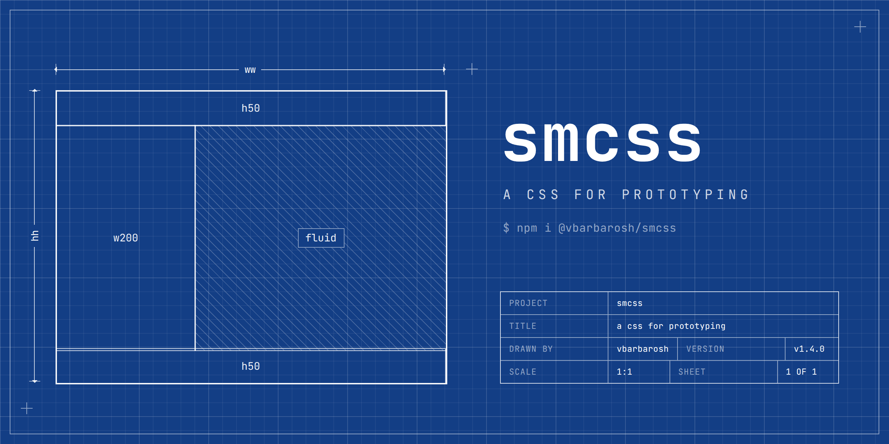

A way to organize and write CSS https://smcss.vbarbarosh.com

    

        

        

        

    

A small set of utility classes for prototyping layouts. Each class does one
thing, so the class list reads as a description of the element: the snippet
above is an 800×200 box centered on the screen, split horizontally into two
200px columns and a fluid middle.

## Installation

    $ npm i @vbarbarosh/smcss

## Using from browser

    <link href="https://unpkg.com/@vbarbarosh/smcss@1.5.1/dist/reset.css" rel="stylesheet" />
    <link href="https://unpkg.com/@vbarbarosh/smcss@1.5.1/dist/sm.css" rel="stylesheet" />

## Examples

### Splitting space

`hsplit` and `vsplit` split a container horizontally or vertically (but not
both). Children are inflexible by default: they keep their `wN`/`hN` size,
and `fluid` takes whatever is left. A classic app shell:

    <body class="abs-f vsplit">
        
header

        

            
sidebar

            
content

        

        
footer

    </body>

### Distributing space among children

Margin groups set the gap between immediate children — no margin after the
last one. `mgN` is for blocks (margin-bottom), `miN` is for inline rows
(margin-right).

    <ul class="mg10">
        <li>first</li>
        <li>second</li>
        <li>third</li>
    </ul>

    

        <button>Save</button>
        <button>Cancel</button>
    

### Centering

    <!-- center a fixed-size box inside the nearest positioned ancestor -->
    
modal

    <!-- center children of a flex row; also: cl, cr, ct, cb, tl, tr, bl, br -->
    
...

### Truncating text

    
one line, then …

    
at most two lines, then …

    
at most three lines, then …

## More

* [Concepts](https://smcss.vbarbarosh.com/concepts) — container, margin group, hsplit
* [Reference](https://smcss.vbarbarosh.com/reference) — every class with its CSS
* [Demos](https://smcss.vbarbarosh.com/demos) — live pages, also in the [demos](demos) directory of this repo

## Development

    $ bin/configure   # npm install
    $ bin/test        # mocha test suite
    $ bin/build       # rebuild dist/ and demos/demo.css
    $ bin/update-docs # regenerate docs/ (requires php)
    $ bin/release     # major|minor|patch — test, bump, rebuild, publish

## Interesting Projects

* [TACHYONS - Functional CSS for humans](https://github.com/tachyons-css/tachyons/)
* [Easy Toggle State](https://twikito.github.io/easy-toggle-state)
* [Responsive Font Sizes](https://github.com/MartijnCuppens/rfs)
* [Tailwind CSS](https://github.com/tailwindcss/tailwindcss)
* [PaperCSS - The less formal CSS framework, with a quick and easy integration](https://github.com/papercss/papercss)
* [Construct.css - Focus on the content and structure of your HTML](https://github.com/t7/construct.css/)
* [rscss - Reasonable System for CSS Stylesheet Structure](https://github.com/rstacruz/rscss)

## Links

* [CSS only Responsive Tables](https://codepen.io/dbushell/pen/wGaamR)

## License

[MIT](LICENSE)
